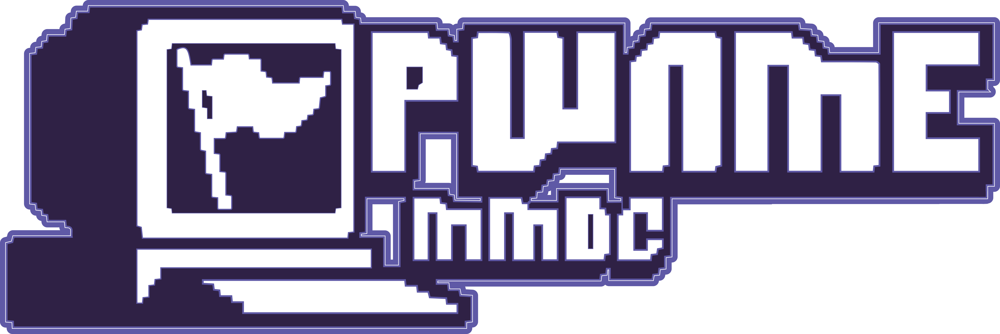

# Challenges PwnMe Junior CTF 2025 Quals


## Développement d'un challenge
1. Développement du challenge sur une branche git dédiée (ex : `rayanlecat-forensic-monchallege`)
2. Création d'une *merge request* sur le repôt github pour demander la validation du challenge. N'hésitez pas à le notifier sur Discord quand vous avez fait une merge request. Une ou plusieurs personnes peuvent tester le challenge, mais l'admin doit approuver la merge request pour valider le challenge.
3. La merge request est approuvé : le challenge est prêt pour le CTF.

### Architecture d'un challenge

Vous trouverez des exemples concrets dans le dossier [_exemple](./_exemple/) du projet.

```
.
└── nom_categorie
    └── nom_challenge
        ├── challenge.yml
        ├── files
        ├── README.md
        ├── solve
        └── src
            └── ...
```


**Le `README.md` :**
  - Mettez-y l'énoncé, les tags s'il y en a, l'auteur (vous, afin de savoir à qui s'adresser lors du CTF s'il y a un problème). Et toute information complémentaire.

**Dans `src` :**
  - Mettez toutes les sources du challenge.
  - Si le challenge est un challenge hébergé sur un conteneur, mettez-y un `Dockerfile`.
  - Si binaire compilé ou fichier pour des challenges de forensic ou reverse par exemple. Mettre juste un fichier url.txt avec lien où on peut télécharger votre fichier.

**Dans `files` :**<br>
  - Les fichiers que vous voulez fournir aux joueurs tel que les sources d'un challenge ou les fichiers d'un challenge forensique.

**Dans `solve` :**<br>
  - Un `README.md` expliquant la procédure de résolution complète du challenge. 
  - Un script permettant de résoudre le challenge automatiquement (permet de vérifier que le challenge fonctionne correctement notamment). Ce script sera utiliser pendant la phase de validation pour vérifier que le challenge fonctionne correctement et pendant le CTF pour vérifier qu'un challenge n'est pas tombé. Ce fichier doit prendre en argument l'adresse où est hébergé le challenge pour aussi bien fonctionné en local qu'à distance.

**Le `challenge.yml` :**<br>
  - Le `challenge.yml` sera utilisé pour configurer le CTFd. Remplissez-le en suivant les exemples
  - Faites-attention à la catégorie qui doit commencer par une majuscule. Exemple : 
    - `Pwn` 
    - `Forensic` 
    - `Web`
