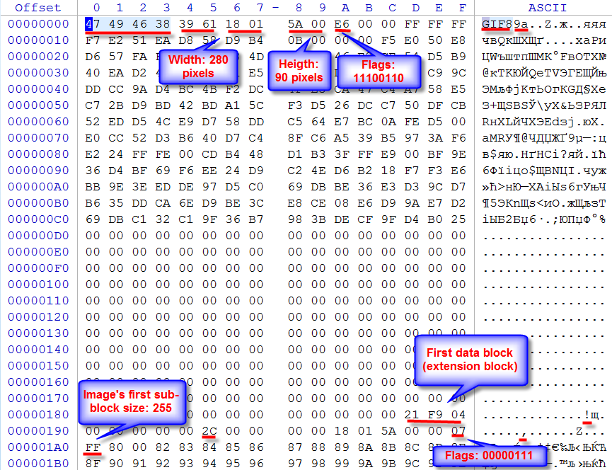
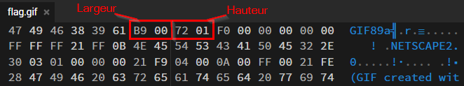
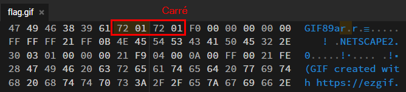
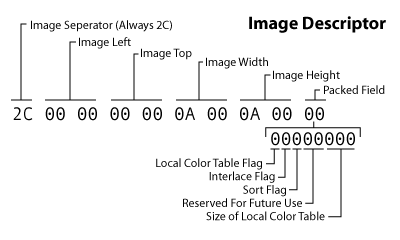
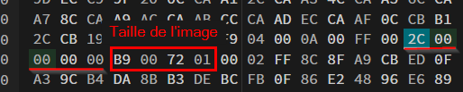
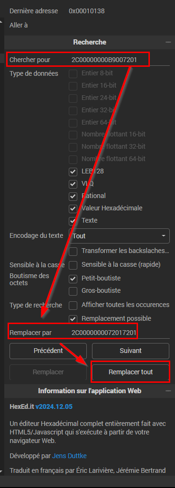

Pour résoudre ce challenge il faut fixer le GIF donné afin qu'il ne soit plus corrompu.

Pour faire cela il faut ouvrir le GIF dans un éditeur hexadécimal et changer les valeurs des octets corrompus. 
Il faut d'abord se familiariser avec la structure d'un fichier GIF.

(Source : https://www.file-recovery.com/gif-signature-format.htm)

- 47 49 46 38 -> GIF8 -> Signature du fichier GIF

- 39 61 -> 9a -> Version du fichier GIF

- 18 01 -> 280 -> Largeur de l'image __*__

- 5A 00 -> 90 -> Hauteur de l'image __*__

**\*** _Toutes les valeurs multi-octets dans les structures GIF sont dans l'ordre little-endian (l'octet de poids faible est placé en premier)._

Dans cet exemple on voit que la largeur et la hauteur de l'image sont codées sur 2 octets chacune.
On imagine qu'un GIF est une image carrée. Alors Width = Height.
Or, notre GIF est corrompu et la largeur et la hauteur de l'image ne sont pas égales.

Quand on regarde l'image, la hauteur semble fixe et ne coupe pas le GIF.
On peut donc en déduire que la hauteur est correcte et que la largeur est corrompue.

Si on utilise ntre GIF, voici les valeurs correspondant àla largeur et la hauteur de l'image :

Et voici à quoi cela devrait ressembler :

Une fois que on a changé ces valeurs et qu'on a un nouveau GIF, on s'aperçoit que le problème n'est pas encore résolu.

En effet, un fichier GIF est composé de plusieurs images qui se suivent, et on peut donc voir et imaginer que d'autres images "à l'intérieur" du fichier sont corrompues.

Chaque donnée d'image commence par un octet qui sert de séparateur, et est toujours égal à `2C`.

Ensuite vient la position de l'image (ses coordonnées), codée sur 4 octets, et généralement égale à `00 00 00 00`, surtout si l'image ne bouge pas.

Puis vient la largeur et la hauteur de l'image, codées sur 2 octets chacune.

(Source : https://giflib.sourceforge.net/whatsinagif/bits_and_bytes.html)

C'est donc ça qui nous intéresse, on va chercher le séparateur et la position de l'image pour trouver chacune des images dans le fichier GIF, et on va changer les valeurs de largeur et de hauteur pour les rendre correctes.

Ici dans la taille de l'image, même scénario qu'avant, on a `B9 00` au lieu de `72 01`.

On change donc ces valeurs pour corriger cette image.

On répète cette opération pour chaque image du fichier GIF, et on obtient un GIF correct.

**Astuce :** Au lieu de tout faire à la main on peut juste chercher pour `2C 00 00 00 00 B9 00 72 01` et remplacer toutes les occurences par `2C 00 00 00 00 72 01 72 01` pour corriger toutes les images en une seule fois.

Maitenant que le GIF est corrigé, on peut lire plein de QR codes qui s'enchaînent, l'un d'eux contient le flag.

On peut décomposer le GIF en plusieurs images en utilisant un outil comme [EzGif](https://ezgif.com/split) pour faciliter la lecture des QR codes.

Le flag est : `PWNME{h3x_1ns1d3_7h3_b0x}`