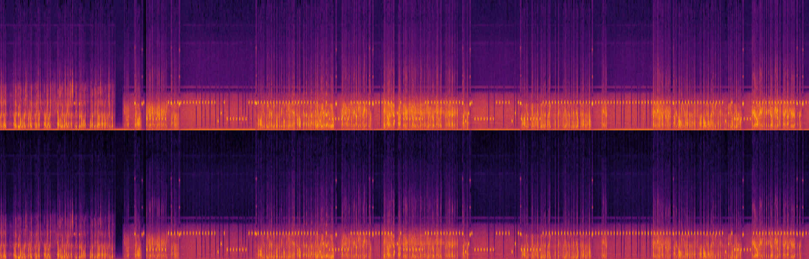
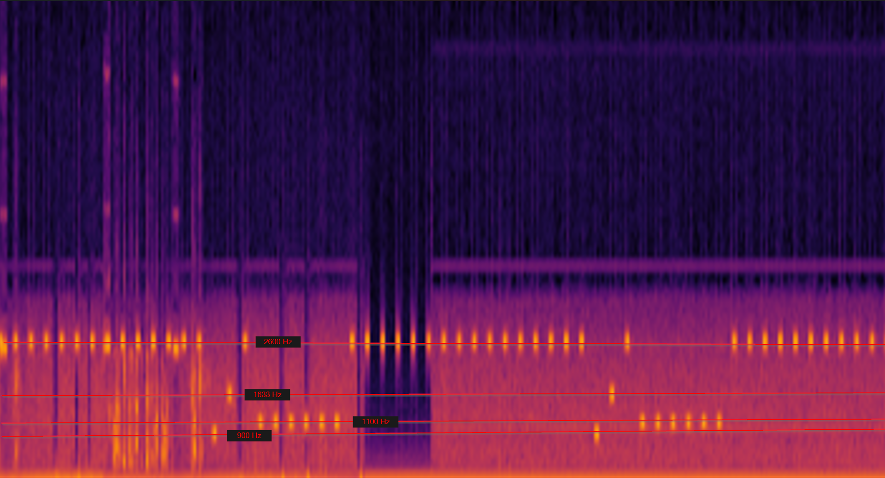

Ce challenge contient un fichier audio `signal.wav` qui contient un audio, et un fichier `phreak.py` qui contient le code qui a permis de générer ce fichier audio. Ou plus précisément la séquence à décoder et qui a été convertie en audio par la suite.

Dans l'audio il y a un audio sur un autre, qui est composé de plein de bip, de réquence différente. On pouvait voir ça en faisant un spectrogramme de l'audio.


(Vue du début de l'audio)

Si on rentre plus dans les détails, et qu'on regarde les fréquences des bips, on peut voir qu'ils sont répartis sur quatre fréquences différentes: 2600Hz, 1633Hz, 1100Hz et 900Hz.



Cela correspond avec ce que génère le code `phreak.py`. Et que chaque fréquence correspond à une action.

```python
"2600"   # incrémente
"1633"   # décale à droite
"900"    # affiche
"1100"   # double
```

Concernant le code :

```python
def encode(self, message):
        # message devrait être le message à encoder 

        # On voit que la liste code est utilisée pour stocker les actions à faire (avec append)
        code = [] 

        # Ici on boucle sur chaque caractère du message
        # Donc tant que on est dans la boucle, on va générer des actions pour chaque caractère
        for char in message:

            # La fonction ord permet de récupérer le code ascii d'un caractère
            # (Là, on devrait se dire que ça devient intéressant)
            # target est donc le code ascii du caractère
            # On va prendre le caractère "P" pour l'exemple, qui a pour code ascii 80
            target = ord(char)
            
            # On voit que le code commence par un décalage à droite
            code.append(self.INC)  # 1 = base
            
            # On va ensuite doubler la valeur de target
            # Tant que la valeur actuelle est inférieure à target, on double
            # Sur papier, ça donne : 1, 2, 4, 8, 16, 32, 64, 128, 256, 512, ...
            # Et on fait ça jusqu'à ce que la valeur actuelle soit supérieure à target
            # Pendant ce temps, DOUBLE (ou 1100) est ajouté à la liste code
            # Donc, si on prend le caractère "P", on va ajouter 1100 7 fois à la liste code
            # (car pour 80, représentant "P" en Ascii, on a besoin de 7 doubles pour arriver à 128, comme 128 est le premier à dépasser 80, on s'arrête là et on va s'en servir pour déterminer ce qu'il reste à ajouter pour arriver à 80 (target))
            current = 1
            code.append(self.DOUBLE)
            while current * 2 <= target:
                # Pendant qu'on double 
                code.append(self.DOUBLE)
                current *= 2

            # On va ensuite incrémenter la valeur actuelle pour arriver à target (80)
            # On va donc ajouter 80 - 64 = 16 fois "2600" à la liste code, "2600" étant l'action pour incrémenter
            remaining = target - current
            for _ in range(remaining):
                # On ajoute "2600"
                code.append(self.INC)

            # À ce stade :
            # - On a décalé à droite
            # - On a doublé 7 fois (= 64)
            # - On a incrémenté 16 fois
            # On va donc afficher le caractère, en ajoutant "900" à la liste code

            # On print le caractère (virtuellement)
            # Ici, c'est la fin de la boucle, on a récupéré 64 + 16 = 80 = "P"
            code.append(self.PRINT)
            code.append(self.NEXT)
                
        return ' '.join(code)
```

Il suffit alors de répéter l'opération en suivant la logique de l'exemple avec "P" pour chaque caractère de la séquence audio, et de décoder le message.

`Astuce:` P est la 16ème lettre de l'alphabet. Donc on peut s'attendre à ce que le message commence par 16 incréments. Cela fonctionne avec les lettres de l'alphabet, mais pas avec les chiffres. Pour les chiffres, il faut les traiter différemment.


Si on reprend ce spectrogramme, on peut voir que la séquence du milieu est constituée comme suit:
- 1 bip à 2600Hz
- 6 bips à 1100Hz
- 16 bips à 2600Hz
- 1 bip à 900Hz
- 1 bip à 1633Hz


On se munie alors de notre tableau de correspondance pour décoder le message.
| 1 | 2 | 3 | 4 | 5 | 6 | 7 | 8 |
|---|---|---|---|---|---|---|---|
| 1 | 2 | 4 | 8 | 16 | 32 | 64 | 128 |

6 doubles = 32
16 incréments = 16

Donc, 32 + 16 = 48 = "0" en ascii.

En faisant ça pour chaque caractère on peut construire le flag suivant :
Flag : `PWNME{4p0110_2600}`

