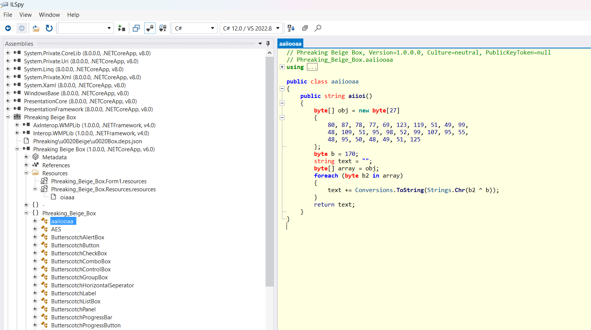

Ouvrir l'exécutable dans un décompilateur .Net (IlSpy par exemple) et chercher la classe qui contient le challenge de crypto ( la classe "aaiiooaa"). Il suffit alors de reverse le XOR qui se trouve dans cette classe pour trouver le flag.
Globalement pour chaque octet dans l'array, on fait `octet ^ 170` pour retrouver le flag.
(Le XOR ne sert qu'à cacher le flag, il n'est pas utilisé pour chiffrer le message)

Flag : `PWNME{w31c0m3_b4ck_70_2013}`