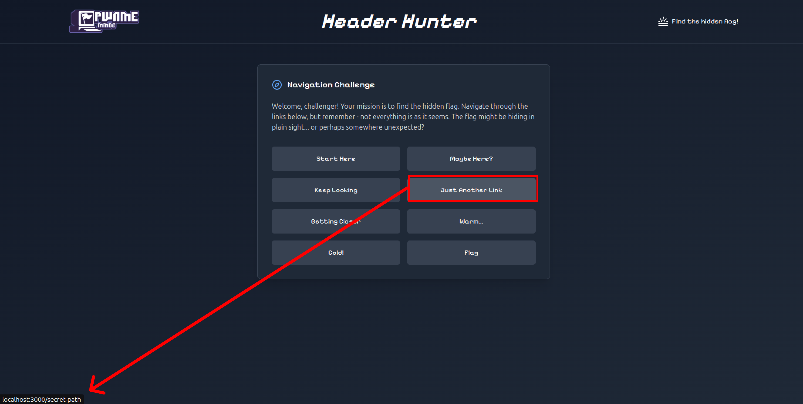
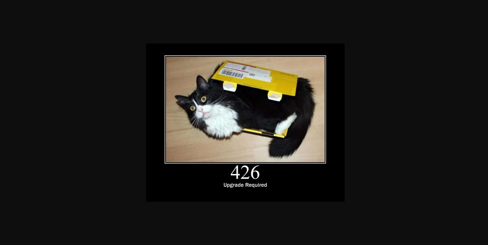
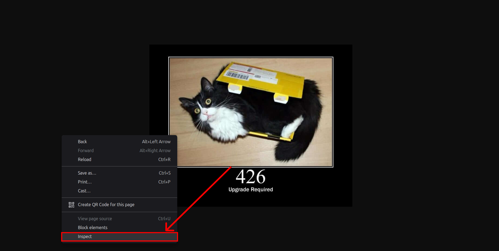
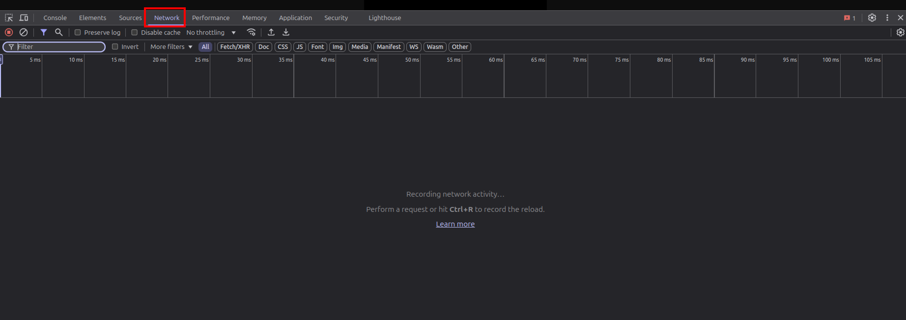
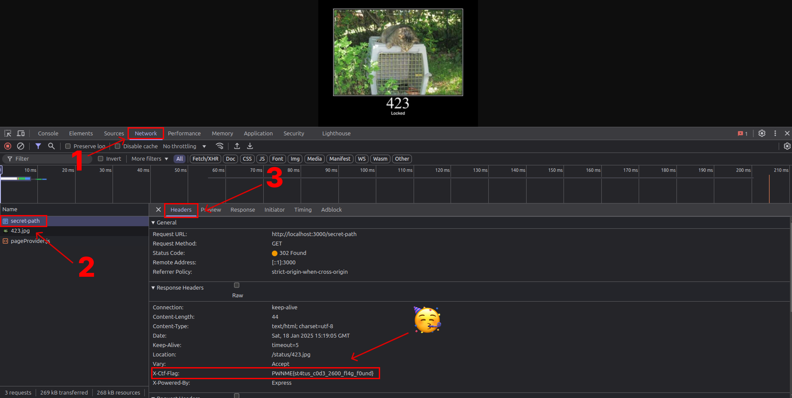

# Header hunter writeup


<br />


## 📃 Table of contents
- [📚 Resources](#resources)
  - [Headers](#headers)
  - [Browser console](#browser-console)
- [📝 Challenge description](#challenge-description)
- [🚩 Solution](#solution)
  - [Using browser's console](#using-browsers-console)
  - [Using curl](#using-curl)
- [📖 What Are HTTP Headers?](#what-are-http-headers)
  - [Request Headers](#request-headers)
  - [Response Headers](#response-headers)
  - [General Headers](#general-headers)
  - [Entity Headers](#entity-headers)
- [🔑 Common Credentials Included/Received Through HTTP Headers](#common-credentials-includedreceived-through-http-headers)
  - [Authentication Headers (Request Headers)](#authentication-headers-request-headers)
  - [Cookies (Request Headers)](#cookies-request-headers)
  - [Response Headers (Server-Sent Headers)](#response-headers-server-sent-headers)
  - [Session and Token Headers](#session-and-token-headers)
  - [CORS (Cross-Origin Resource Sharing) Headers](#cors-cross-origin-resource-sharing-headers)
  - [Security Headers](#security-headers)
  - [API Keys (Custom Headers)](#api-keys-custom-headers)
  - [Other Miscellaneous Headers](#other-miscellaneous-headers)
- [👨‍💻 Author](#author)


<br />
<br />


## Resources
- **Headers**:
    - https://developer.mozilla.org/fr/docs/Web/HTTP/Headers
    - [RFC 2616 - Hypertext Transfer Protocol -- HTTP/1.1](https://datatracker.ietf.org/doc/html/rfc2616)
    - [RFC 6265 - HTTP State Management Mechanism (Cookies)](https://datatracker.ietf.org/doc/html/rfc6265)
    - [RFC 7230 - Hypertext Transfer Protocol (HTTP/1.1): Message Syntax and Routing](https://datatracker.ietf.org/doc/html/rfc7230) ***Recommended***
    - [RFC 7231 - Hypertext Transfer Protocol (HTTP/1.1): Semantics and Content](https://datatracker.ietf.org/doc/html/rfc7231)
- **Browser console**:
    - https://developer.chrome.com/docs/devtools/console
    - https://developer.mozilla.org/fr/docs/Web/API/console


<br />
<br />


## Challenge description  

Navigating the internet is cool, but what's even cooler is understanding how machines communicate with each other.


<br />
<br />


## Solution

<br />

### Using browser's console

First of all just by reading at the title, we can have a hint on what we expect for this challenge ***HEADERS*** !
> [!NOTE]
> When navigating the internet, **HTTP headers** play a vital role in communication between clients (e.g., web browsers) and servers.

When landing to the web page, we are facing 6 links with a text. But when looking closely we have a link that appear
quite mysterious

<div style="text-align: center;">
  
  <p><em>link leading to "secret-path" endpoint</em></p>
</div>

When clicking on it, we're getting redirected to some cool *cat status code*, at first glance nothing special...

<div style="text-align: center;">
  
  <p><em>kawai cat</em></p>
</div>

But here is the trick, remind about the title. Lucky us most browser include a ***console*** that allow us to do and see a lot more about our web activities.
You can open it by just doing `right click` then go to `inspect`
> [!TIP]
> For shortcut see => https://chatgpt.com/share/678bccb9-b9f0-8011-a74e-ddb838c3ddd2


<div style="text-align: center;">
  
  <p><em>openning browser's console</em></p>
</div>

Then go to `Network` tab aaaannnnnnnd nothing.... wut ?

<div style="text-align: center;">
  
  <p><em>Empty network activities</em></p>
</div>

Indeed when openning the console it will be empty, completely fresh, we need to do the previous step again from scratch.

Hopefully this time we see all the request being made by our browser and by inspecting closely the requests we can see all those extra informations we don't see in a normal web activity.

<div style="text-align: center;">
  
  <p><em>🚩</em></p>
</div>

The flag was indeed put as a header in the `secret-path` endpoint 🥳

*PWNME{st4tus_c0d3_2600_fl4g_f0und}*

<br />

### Using curl

You can also use `curl` command from a terminal to grab easily the flag

```bash
curl -I  http://localhost:3000/secret-path

# output:
#
# HTTP/1.1 302 Found
# X-Powered-By: Express
# X-CTF-Flag: PWNME{st4tus_c0d3_2600_fl4g_f0und}
# Location: /status/201.jpg
# Vary: Accept
# Content-Type: text/plain; charset=utf-8
# Content-Length: 37
# Date: Sat, 18 Jan 2025 16:51:35 GMT
# Connection: keep-alive
# Keep-Alive: timeout=5
```

Here the `-I` will just grab the header from the response


<br />
<br />


## What Are HTTP Headers?

HTTP headers are metadata included in HTTP requests and responses. They provide additional context about the data being sent or received.

### Key Types of HTTP Headers

1. **Request Headers**  
   Sent by the client to provide information about the request.  
   Examples:
   - `User-Agent`: Details about the client's browser or device.
   - `Accept`: Specifies the types of data the client can handle (e.g., `application/json`).

2. **Response Headers**  
   Sent by the server to describe the returned data or provide instructions.  
   Examples:
   - `Content-Type`: Indicates the type of data returned (e.g., `text/html`).
   - `Cache-Control`: Controls caching behavior.

3. **General Headers**  
   Used in both requests and responses for shared information.  
   Examples:
   - `Date`: Timestamp of the HTTP message.
   - `Connection`: Controls connection options (e.g., `keep-alive`).

4. **Entity Headers**  
   Describe the body of the request or response.  
   Examples:
   - `Content-Length`: Size of the data in bytes.
   - `Content-Encoding`: Specifies how the data is compressed.


<br />
<br />


## Common Credentials Included/Received Through HTTP Headers

### **1. Authentication Headers (Request Headers)**
These headers carry information for authentication or credentials to identify and authorize the client.

- **`Authorization`**: Contains the credentials for HTTP authentication. Common types include:
  - `Bearer`: Used with OAuth tokens (e.g., `Authorization: Bearer <token>`).
  - `Basic`: Used with username and password encoded in Base64 (e.g., `Authorization: Basic <Base64EncodedCredentials>`).
- **`Cookie`**: Sends stored cookies from the client to the server. This may include session identifiers or other authentication-related data (e.g., `Cookie: sessionId=12345`).
- **`Proxy-Authorization`**: Similar to `Authorization`, but used for authenticating with a proxy server.

### **2. Cookies (Request Headers)**
Cookies can be used for storing credentials and other session-related information.

- **`Cookie`**: Contains the cookies associated with the domain, which can include session IDs or persistent login information (e.g., `Cookie: userId=789; sessionToken=abc123`).

### **3. Response Headers (Server-Sent Headers)**
Servers can send credentials or sensitive information related to authentication and authorization back to the client.

- **`Set-Cookie`**: Used to send cookies from the server to the client, which can include session tokens or authentication details (e.g., `Set-Cookie: sessionId=12345; Secure; HttpOnly`).
- **`WWW-Authenticate`**: Specifies the authentication method required for accessing a resource (e.g., `WWW-Authenticate: Basic realm="Secure Area"`).

### **4. Session and Token Headers**
These headers are often used for session management or API authentication.

- **`X-Auth-Token`**: A custom header often used to send an authentication token (e.g., `X-Auth-Token: <token>`).
- **`Authorization` (again)**: In some cases, tokens (API tokens, JWT, OAuth tokens) are included in `Authorization` headers to authenticate API requests (e.g., `Authorization: Bearer <token>`).

### **5. CORS (Cross-Origin Resource Sharing) Headers**
These headers control how credentials are sent between different origins.

- **`Access-Control-Allow-Credentials`**: Indicates whether the browser should include credentials in requests for cross-origin resources (e.g., `Access-Control-Allow-Credentials: true`).
- **`Access-Control-Allow-Origin`**: Specifies the origins allowed to access the resource, especially when dealing with cross-origin requests. It may also include `*`, which allows all domains.

### **6. Security Headers**
Some headers are used to ensure secure transmission of credentials or tokens.

- **`Strict-Transport-Security (HSTS)`**: Informs browsers that HTTP connections to the server should only be made over HTTPS (e.g., `Strict-Transport-Security: max-age=31536000; includeSubDomains`).
- **`X-Content-Type-Options`**: Prevents browsers from interpreting files as a different MIME type, which helps avoid certain types of attacks.

### **7. API Keys (Custom Headers)**
Sometimes, credentials are passed via custom headers for authentication.

- **`X-Api-Key`**: A custom header to send API keys for authentication (e.g., `X-Api-Key: <api_key>`).
- **`X-Access-Token`**: A custom header used for token-based authentication (e.g., `X-Access-Token: <token>`).

### **8. Other Miscellaneous Headers**
These may also be related to credentials, especially in the context of custom authentication methods or session handling.

- **`X-Requested-With`**: Often used in AJAX requests to identify the origin of the request, sometimes with a value like `XMLHttpRequest`. It doesn't carry credentials directly but may be used for session identification or CSRF prevention.

<br />

### Example Summary of Common Headers with Credentials:

#### **Request Headers:**
- `Authorization: Bearer <token>`
- `Cookie: sessionId=xyz123; userToken=abc456`
- `X-Auth-Token: <token>`
  
#### **Response Headers:**
- `Set-Cookie: sessionId=xyz123; Path=/; HttpOnly; Secure`
- `WWW-Authenticate: Basic realm="Restricted Area"`

#### **Session Management:**
- `X-Api-Key: <api_key>`
- `X-Access-Token: <token>`

#### **Security Headers:**
- `Strict-Transport-Security: max-age=31536000`
- `X-Content-Type-Options: nosniff`

#### **CORS Headers:**
- `Access-Control-Allow-Credentials: true`
- `Access-Control-Allow-Origin: https://example.com`


<br />
<br />


## Author

**Tondelier Jonathan**